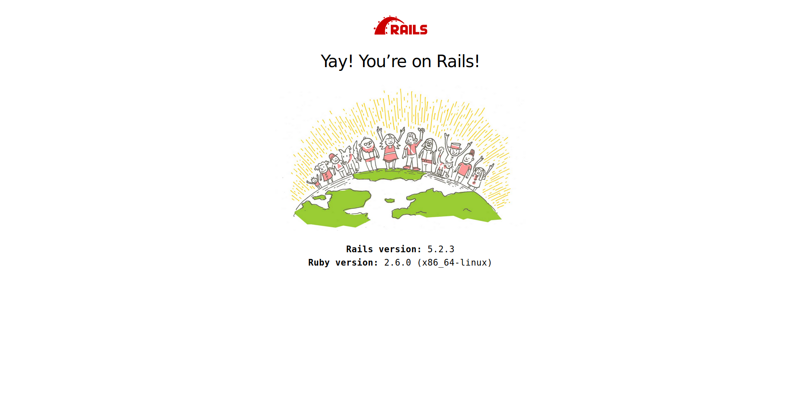

## First steps

### Installation

If required, install rails:

```
gem install bundler
gem install rails
```

As PostgreSQL will be used, the `pg` gem needs to be installed. Prior
to this, some PostgreSQL package needs to be installed under Ubuntu
(Ref: [StackOverflow](https://stackoverflow.com/a/48112095/4906586)):

```
sudo apt-get install postgresql-server-dev-11
gem install pg
```

The project can now be created:

```
rails new learn-rails
```

### Database configuration

Before running the application, few modifications are required:

- Ensure that the database has an user for our Rails app. Make sure this
  user can create database.
- To get aligned with Heroku, I use `DATABASE_URL` as connection URL.
  the _config/database.yml_ looks like:

  ```yaml
  default: &default
  adapter: postgresql
  encoding: unicode
  pool: <%= ENV.fetch("RAILS_MAX_THREADS") { 5 } %>
  url: <%= ENV['DATABASE_URL'] %>

  development:
  <<: *default

  test:
  <<: *default

  production:
  <<: *default
  ```

- Add the [`dotenv-rails`](https://github.com/bkeepers/dotenv) to
  your _Gemfile_ and run `bundle install` to have
- Create _.env.development.local_ and _.env.test.local_ and add
  the appropriate `DATABASE_URL`.
- Create the database with

  ```sh
  bundle exec rails db:setup
  ```

Our app is currently empty and runs against an empty database:

```sh
bundle exec rails server
```

You will see a Rails page on <http://localhost:3000>:


