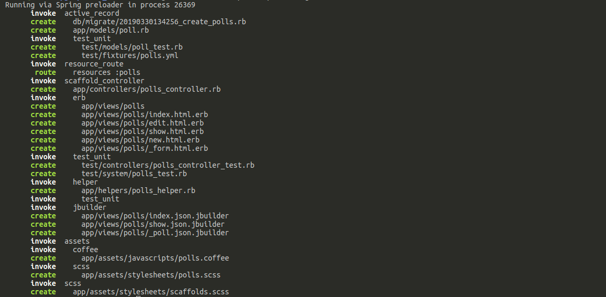
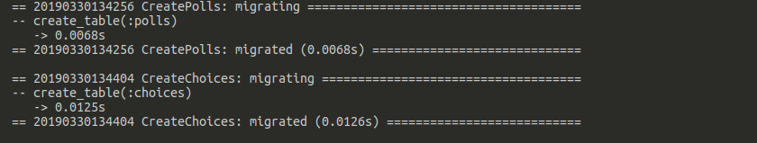

## Polls

### Scaffolds

Instead of manually create models, controllers and view, Rails offers
the awesome scaffold

```
rails generate scaffold poll topic:string
```

which outputs:



Our poll is meaningless without any choice. Let's add choices with
the scaffold option.

> Alternative is to generate only models with `rails generate model polls/choice`
> and the build our controller (`rails generate controller polls/choice`) and 
> finally creating views

```sh
rails generate scaffold choice text:string poll:references
```

Sources:

- <https://guides.rubyonrails.org/command_line.html#rails-generate>
- <https://kolosek.com/rails-scaffold/>
- <https://guides.rubyonrails.org/active_record_migrations.html#creating-a-standalone-migration>

### Migrations

Before running our server, we need to update our database. Scaffold 
nicely generated migrations so all we have to do is:

```
bundle exec rails db:migrate
```

